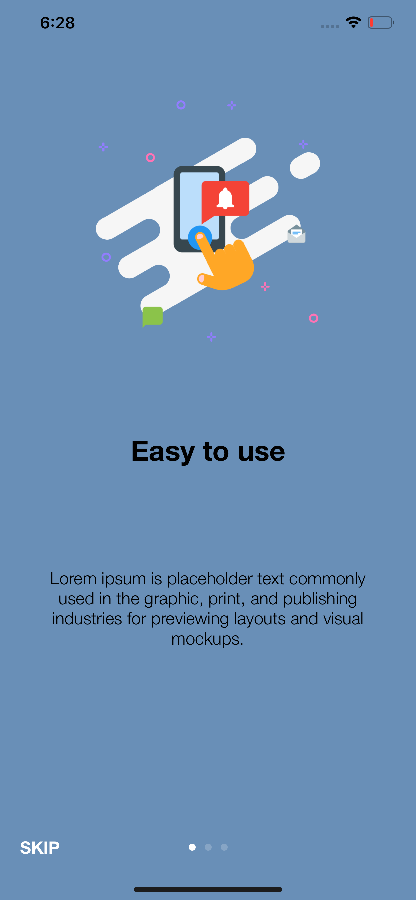
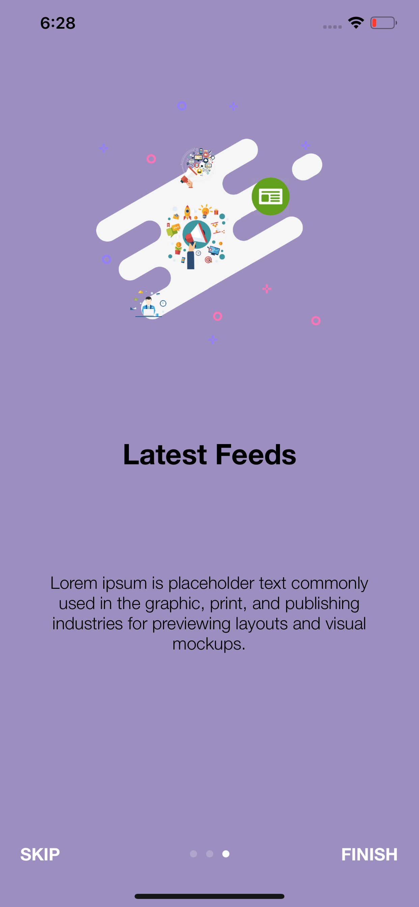
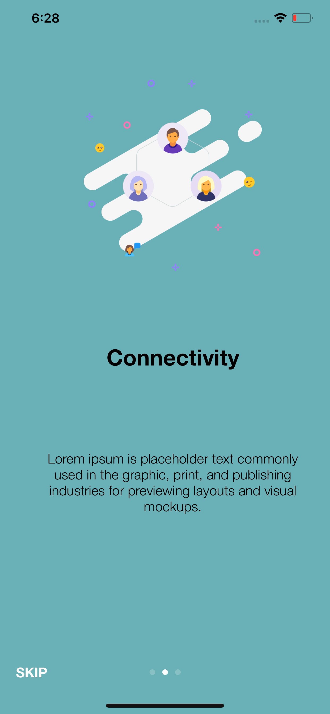

# OnBoarding

<h3>OnBoarding screen using simple uicollectionview</h3>

Without adding any external library we can create our own on boarding screens using <b>UICollectionView</b>. There is only few steps required to create it and this project will give veryone an idea about that.

# Screen shot 1

# Screen shot 2

# Screen shot 3

